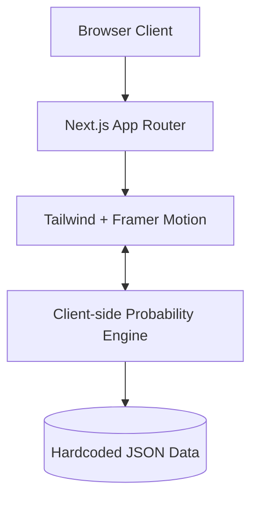
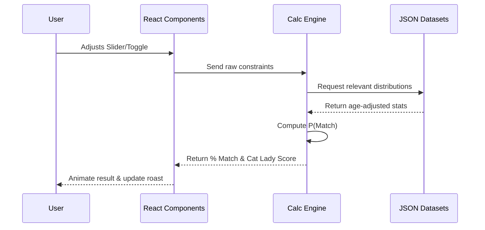
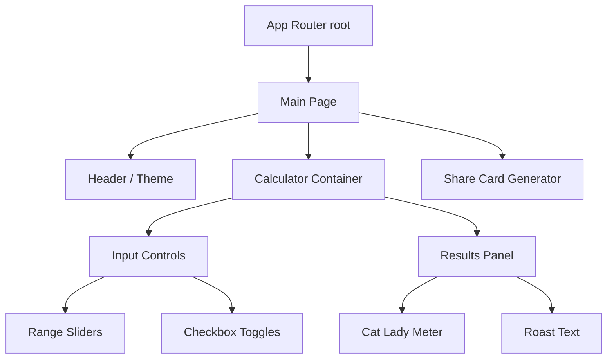

# Architecture

This document outlines the system architecture for the Delusion Calculator.

## System Overview

## Tech Stack Details

- **Framework**: Next.js 15 (React 19)
- **Language**: TypeScript
- **Styling**: Tailwind CSS v4
- **Animations**: Framer Motion
- **Hosting**: Vercel

## Client-Side Calculation Flow

The core of the application relies entirely on client-side calculations for Phase 1. 

1. User inputs preferences (e.g., Age 25-35, Height > 6'0", Income > $100k).
2. The UI triggers the `calculateProbability()` function in the `lib` folder.
3. The calculator fetches the required static JSON data from the `data` folder.
4. Independent probabilities are calculated and multiplied (assuming conditional independence adjusted for age).
5. The result is returned to the UI in < 1ms.

## Data Flow Diagram

## Component Hierarchy

## File Structure

- `src/app/page.tsx`: Entry point.
- `src/components/`: Modular UI (e.g., `Slider.tsx`, `Meter.tsx`).
- `src/lib/calculator.ts`: The math logic.
- `src/data/`: `census.json`, `nhanes.json`, `roasts.json`.

## Phase 2 Architecture

In Phase 2, the app will introduce Next.js API Routes (`src/app/api/`) to interact with the **Gemini AI API**. 
- The client will send the user's specific inputs and score to the `/api/roast` endpoint.
- The serverless function will prompt Gemini to generate a unique, context-aware Fresh & Fit style roast.
- The response will be streamed back to the client.

## Performance Requirements

- **Calculation Time**: < 1ms
- **Render Frame Rate**: < 16ms (60 FPS for animations)
- **First Contentful Paint (FCP)**: < 1.5s
