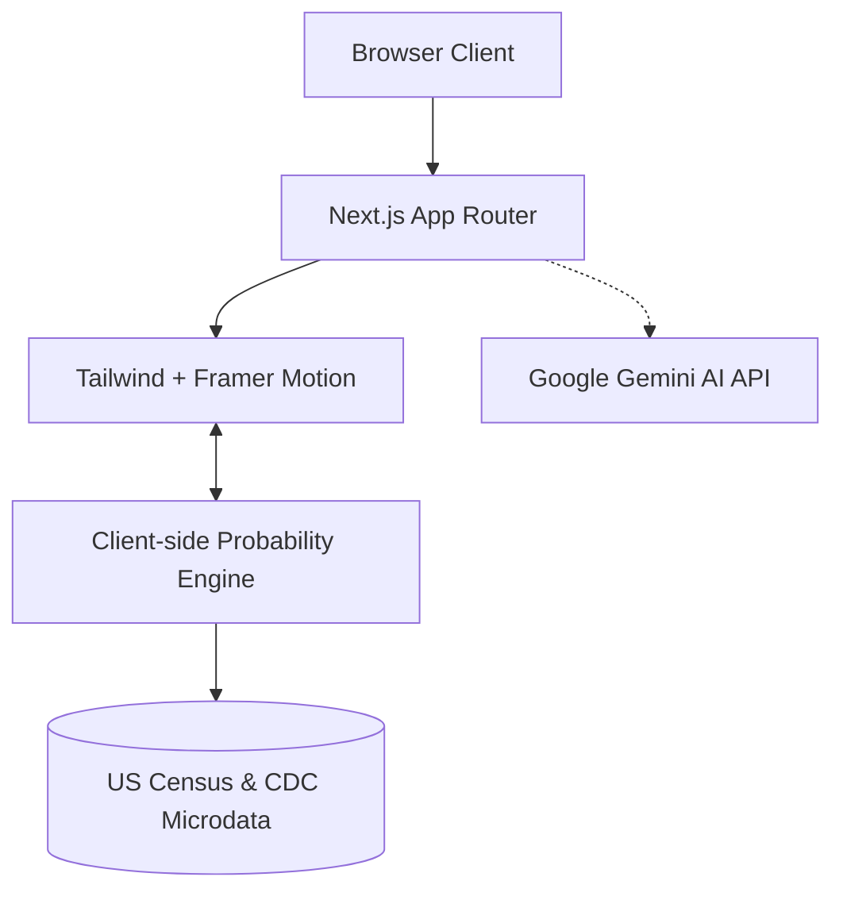
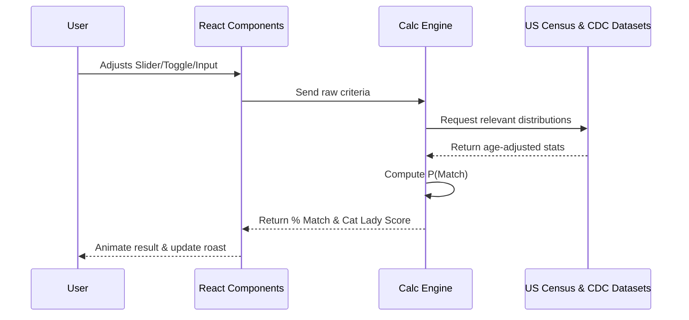

# Architecture

This document outlines the system architecture for the Delusion Calculator.

## System Overview

## Tech Stack Details

- **Framework**: Next.js 16 (React 19, Turbopack)
- **Language**: TypeScript (Strict Mode)
- **Styling**: Tailwind CSS v4 + 80s Vaporwave Aesthetics
- **Animations**: Framer Motion
- **Hosting**: Vercel

## Client-Side Calculation Flow

The core of the application relies on instant client-side joint probability math:

1. User inputs preferences (e.g., Age 22-35, Height > 6'0", Income > $80k).
2. The UI triggers `calcCombinedProbability()` in `src/engine/probability.ts`.
3. The calculator fetches static age-conditional distributions from `src/data/distributions.ts`.
4. Independent probabilities are calculated and multiplied (adjusted for age-income and age-marital correlations).
5. The result is returned to the UI in < 1ms.

## Data Flow Diagram

## Planned Feature Architecture (Next Releases)

### 1. 👶 Children & Prior Marriage Criteria Engine
- Expand `CriteriaState` interface with `excludeKids: boolean`, `wantsKids: boolean`, and `excludePriorMarriage: boolean`.
- Incorporate Census ACS marital history and CDC family fertility tables into `src/engine/probability.ts`.

### 2. 📺 Streamer Mode (OBS Chromakey & Hotkeys)
- Add hotkey event listener (`window.addEventListener('keydown')`) mapping keys 1-9 to trigger `GlobalAudio` soundboard clips.
- Provide a dedicated `/stream` page with background transparency and green-screen chromakey color pickers.

### 3. 📸 HD Image Export (`html-to-image`)
- Integrate `html-to-image` canvas rendering to convert `#share-card-graphic` element directly into downloadable 1080x1920 PNG files for social media stories.

### 4. 🤖 AI-Powered Podcast Roasts (Gemini API)
- Introduce serverless route `/api/roast` using `@google/genai` SDK.
- Prompt Google Gemini Flash API with user criteria to stream dynamic, context-aware podcast roast commentary.

## Performance Requirements

- **Calculation Time**: < 1ms
- **Render Frame Rate**: 60 FPS for Framer Motion animations
- **First Contentful Paint (FCP)**: < 1.0s
