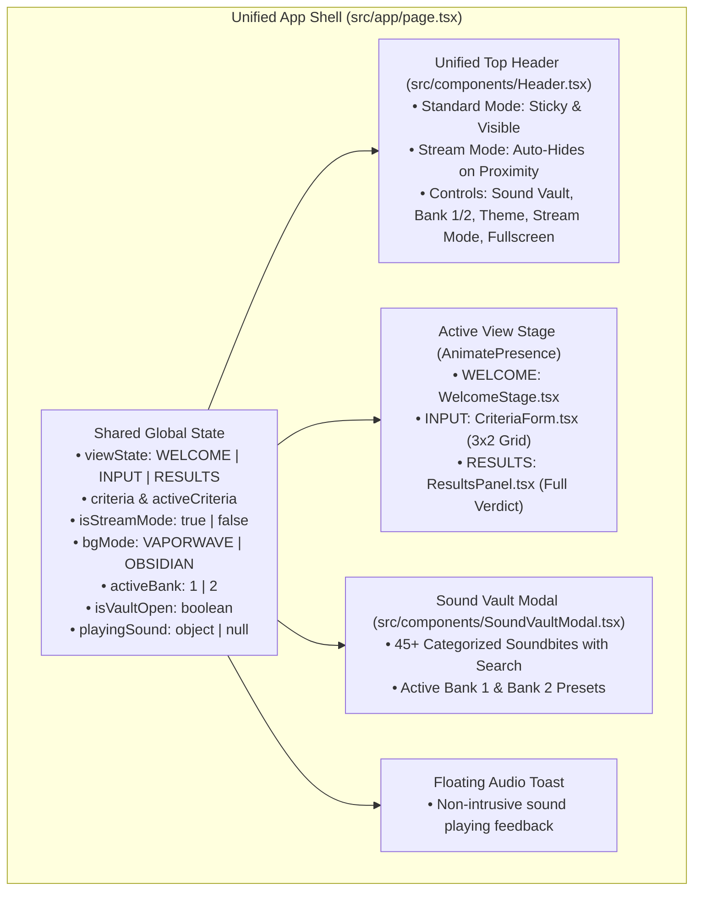
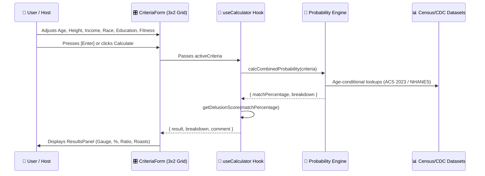

# System Architecture & Technical Specifications

> **Project: The Delusion Calculator**

---

## 1. Architectural Overview

The application is built on **Next.js 15 (App Router)** with **TypeScript (Strict Mode)** and **Tailwind CSS v4**. It uses a **Unified Single-Shell Architecture** to handle both standard web visitors and live OBS broadcast overlays without state fragmentation or page reloads.

---

## 2. Core State Management & Navigation Flow

1. **Single Source of Truth**:
   - `viewState`: Switches between `'WELCOME'`, `'INPUT'`, and `'RESULTS'`.
   - `isStreamMode`: Boolean state toggled by `[Space]` or Header button. Because state lives in the parent shell, toggling Stream Mode does not discard active form inputs or calculation results.
   - `criteria`: Current form values.
   - `activeCriteria`: Committed form values passed to `useCalculator` upon clicking *Calculate* or pressing `[Enter]`.

2. **Unified Navigation Matrix**:
   - `[Space]`: In-place Stream Mode toggle.
   - `[Enter]`: Advances `WELCOME` $\rightarrow$ `INPUT` $\rightarrow$ `RESULTS` $\rightarrow$ `INPUT`.
   - `[Tab]` / `[` `]`: Swaps Sampler Bank 1 and Bank 2.
   - `[1]` to `[0]`: Triggers audio drops corresponding to active bank presets.

---

## 3. Calculation Engine Flow

---

## 4. Performance Benchmarks

* **Calculation Latency**: $< 1.0\text{ ms}$ (pure client-side synchronous arithmetic).
* **Frame Rate**: $60\text{ FPS}$ smooth rendering on HTML5 canvas particle repulsion.
* **First Contentful Paint (FCP)**: $< 1.2\text{ s}$.
* **Zero Runtime Server Costs**: 100% static prerendered client-side application.
